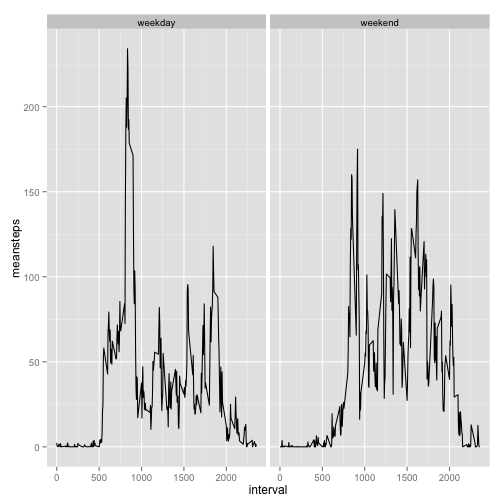

## Loading and preprocessing the data


```r
unzip("activity.zip")  #Unzip data.
activity<-read.csv("activity.csv")  ## read file into R
```

Convert the dates into proper dates, using as.Date and as.factor.


```r
activity$date<-as.Date(activity$date)
activity$date<-as.factor(activity$date)
library(lubridate)
activity$weekday<-wday(activity$date, label=TRUE)
```
## What is mean total number of steps taken per day?

The best way to determine this is to convert days into a factor and make a new dataframe that is the result of summing the step in each day. Then use this dataframe to make a mean over all days.


```r
library(dplyr)
activity<-tbl_df(activity)
activity_day<-group_by(activity,date)
results<-summarize(activity_day,sum(steps,na.rm=TRUE))
### Datatable "results" keeps the information.
colnames(results)<-c("date","dailysteps")
mean(results$dailysteps)
```

```
## [1] 9354
```

```r
median(results$dailysteps)
```

```
## [1] 10395
```

```r
hist(results$dailysteps, breaks = 10, main = "Frequency of days with steps in range")
```

 

Results show a normal-looking distribution with possible outliers at zero and >20,000. The mean number of steps per day is 9354. The median number of steps per day is 10395.

## What is the average daily activity pattern?

The only information about time in the day is contained in the interval number. 


```r
activity_minutes<-group_by(activity,interval)
stepstime<-summarize(activity_minutes,mean(steps,na.rm=TRUE))
names(stepstime)<-c("interval","avesteps")
stepstime$interval<-as.integer(stepstime$interval)
plot(stepstime$interval,stepstime$avesteps,type="l")
```

 

```r
which.max(stepstime$avesteps)
```

```
## [1] 104
```
Conclusions: the highest activity is at 835.


## Imputing missing values

The technique for calculating a value to impute for missing values is calculate an average for that time of day. This information is in the dataset stepstime and needs to be transferred back to the dataset activity. 

First, how many values are NA?
There are 17568 rows in the dataset activity. There are 15264 complete cases. Therefore, there are 2304.  

I want to use the mean for each 5 minute interval across the days to fill in the missing values.


```r
## Use merge to fill up the table with avesteps as a new variable.
newdata<-merge(activity,stepstime,by="interval")

## Note that order has been changed, but that isn't important.

newdata$imputesteps<-ifelse(is.na(newdata$steps), newdata$avesteps,newdata$steps)

###YAYYYYYYY, this actually fills in the missing values
```


Now to repeat the analysis with imputed values.


```r
newdata_group<-group_by(newdata,date)
newresults<-summarize(newdata_group, sum(imputesteps))
names(newresults)<-c("date","imputesteps")
### Datatable "results" keeps the information.
mean(newresults$imputesteps)
```

```
## [1] 10766
```

```r
median(newresults$imputesteps)
```

```
## [1] 10766
```

```r
hist(newresults$imputesteps, breaks = 10, main = "Frequency of days with steps in range using imputed data",xlab="Steps with imputed steps")
```

 


The mean steps per day are 1.0766 &times; 10<sup>4</sup> and the median steps per data are 1.0766 &times; 10<sup>4</sup>.  These are higher than before, which makes sense. The mean equals the median, which makes me think there is a mistake in the calculation. But I can't find it yet. There are many fewer days with lower numbers of steps in the histogram. 

## Are there differences in activity patterns between weekdays and weekends?

First figure which days are weekend and which are not. 


```r
## Setup weekend vs weekday as a factor.
activity$weekend<-
    ifelse(activity$weekday %in% c("Mon","Tues","Wed","Thurs","Fri"),"weekday","weekend")
activity$weekend<-as.factor(activity$weekend)
```

Then break into two datasets, one for weekends and one for weekdays.


```r
### group_by can use more than one factor, summarize will work by the latest factor grouped
activity_weekend_int<-group_by(activity,weekend,interval)
activity_weekend<-summarize(activity_weekend_int,mean(steps,na.rm=TRUE))
names(activity_weekend)<-c("weekend","interval","meansteps")
```

Plot two diagrams of average steps vs. time on weekdays, and average steps vs. time on weekend days.


```r
library(ggplot2)
ggplot(activity_weekend,aes(interval,meansteps)) + geom_line() + facet_grid(.~weekend)
```

 
